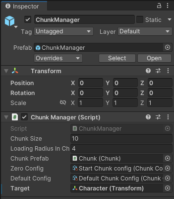
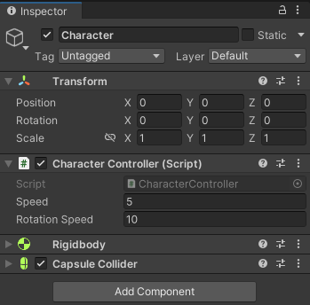
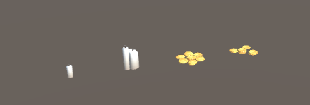
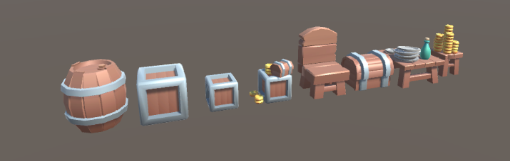

# World-Generator

Demo video:

https://github.com/A1exdV/World-Generator/assets/63784286/d0847354-1974-49e1-9cbf-e405ce36a01b

Editor look video:

https://github.com/A1exdV/World-Generator/assets/63784286/3b935642-7c18-414a-a7e9-3813b71a5be1

-----------------------
- [Game Files](https://github.com/A1exdV/World-Generator/tree/main#game-files)
- [Code](https://github.com/A1exdV/World-Generator/tree/main#code)
-----------------------
# Game Files

## Chunk Manager:

Responsible for creating and processing chunks in the game world.



- Chunk size - Width and length of the chunk grid and chunk size in the game world.
- Loading radius in chunks - Sets the rendering area for chunks around a given object.
- [Chunk prefab](https://github.com/A1exdV/World-Generator/tree/main#chunk) - Prefab of an empty chunk responsible for visual content in the game world.
- [Zero config](https://github.com/A1exdV/World-Generator/tree/main#chunk-config) - Configuration of an empty chunk for zero coordinates (so that the character does not appear inside the object and there are exits from the chunk).
- [Default config](https://github.com/A1exdV/World-Generator/tree/main#chunk-config) - config used to configure all chunks.
- Target - object that is the center of rendering chukns

## Character:

Simple third person character controller



## Chunk Prefab:


Plane with 2 side walls and 2 smoler walls for colosing or opening passages.


## Decor models:



## Obstacle models:



# Code

## Chunk

Script on chunk prefab object. Instantiate decorative and obstacles object in chunk based on [Chunk Data](https://github.com/A1exdV/World-Generator/tree/main#chunk-data).
Also hide or show passages.

```C#
    public class Chunk : MonoBehaviour
    {
        [SerializeField] private Transform floor;
        [SerializeField] private GameObject upWayWall;
        [SerializeField] private GameObject rightWayWall;

        private ChunkData _chunkData;

        public void UpdateChunkData(ChunkData chunkData)
        {
            _chunkData = chunkData;
            DestroyChildes();
            InstantiateStaticObjects();
            SetWayWalls();
        }
```

## Chunk Data

Store the information about [objects](https://github.com/A1exdV/World-Generator/tree/main#objectdata) and passage state in a separate chunk

```C#
    public class ChunkData
    {
        public Dictionary<Vector2Int, ObjectData> StaticObjectsDictionary { get; private set; }
        
        public bool IsUpWayOpen { get; private set; }
        public bool IsRightWayOpen { get; private set; }
        ...
    }
```

## ObjectData

Store information about a separate object (obstacle or decorative) in chunk
```C#
    public class ObjectData
    {
        public Transform TransformObject;
        public float Rotation;

        public ObjectData(Transform transformObject, float rotation)
        {
            TransformObject = transformObject;
            Rotation = rotation;
        }
    }
```

## Chunk Config

```C#
    public class ChunkConfigSo : ScriptableObject
    {
        [field:SerializeField,Range(0,1)]public float ObstacleChance { get; private set; }
        [field:SerializeField,Range(0,1)]public float DecorativeChance { get; private set; }
        [field:SerializeField,Range(0,1)]public float OpenWayChance { get; private set; }
        
        [field:SerializeField]public Transform[] ObstaclePrefabArray { get; private set; }
        [field:SerializeField]public Transform[] DecorativePrefabArray { get; private set; }
    }
```
